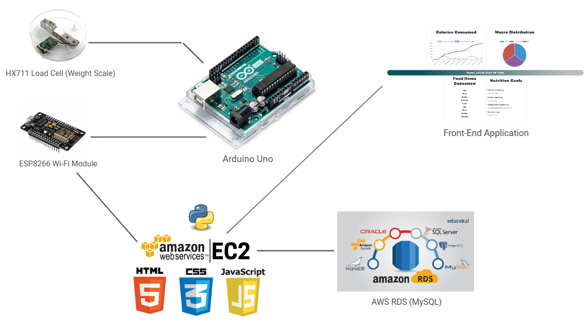
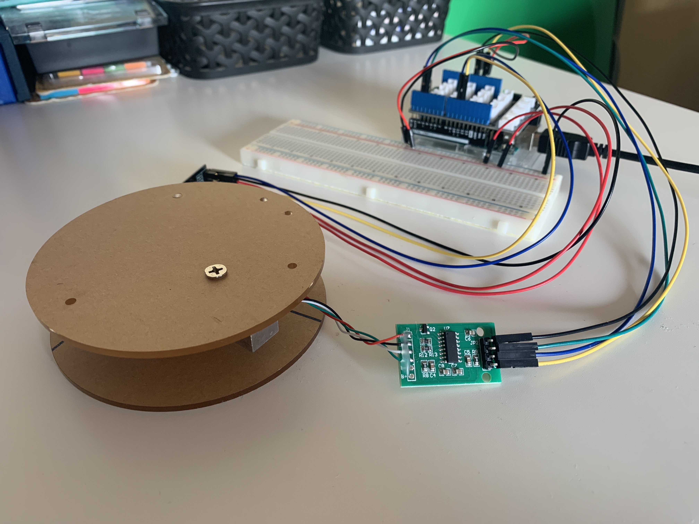

# ZotCalZ (CS 147: Project in IoT)
There are currently web and mobile applications that help the user to track calories and macronutrients by
manually inputting information (current food item and its respective calorie and nutrition information) into the
app, however there is no current mainstream way to automate the process of inputting that information.
ZotCalZ attempts to automate the process of having to input calories and nutrient data of the food items
consumed during the day with an IoT-based solution. An Arduino Uno and a corresponding weight scale
(HX711 Load Cell) is used to gather readings in grams from the food item(s). The Wi-Fi module attached the
Arduino Uno is set up to send the weight reading to the AWS EC2 instance, which also contains the backend and front-end implementation.
The back-end implementation utilizes an AWS RDS (MySQL) database which contains real-world data of 
food items such as calories, protein, carbohydrate, and fat content. The calorie and nutrient calculations are
performed based off a ratio of the gram reading and the reading in the database. This information is passed
from the back-end to the front-end through context objects, in which the information is displayed to the user
through charts including line graphs and bar graphs. From the charts, the user can interpret how many
calories they have consumed at a particular instance (including a cumulative amount of calories), the
macronutrients they from the food items consumed, and see how much progress they have left to reach their
nutrition goals for the day.

# System Architecture
This project incorporated hardware components such as the Arduino Uno and Digital Load Cell Weight Sensor
(HX711).
The front-end was constructed in HTML, CSS, JavaScript, and Chart.js. The back-end was developed using Flask,
AWS EC2, AWS RDS, MySQL, and C++ (Arduino IDE).
The program begins with the Flask app (server) being launched. The Arduino IDE is compiled next (the order
between the Arduino Uno and Flask server does not matter too much, either can be started first). The weight scale is
zeroed and then a food item is placed onto the scale. Next, the readings are sent to Flask. Flask catches the data via
an asynchronous function, request.args.get(), and interprets that data by calculating the ratio between the reading
in grams and the value in the database holding the nutrition data. Flask uses that ratio to calculate the calories,
protein, carbohydrate, and fat content of the food. The data for each food item is pulled from a table called FoodItem
in the AWS RDS (MySQL in this instance) database via pymysql to be used during the previous calculation. After this
data is interpreted, other data is pulled from the database such as the calorie, protein, carbohydrate, and fat goals as
well as the food items currently consumed in the User and FoodDiary tables in the database respectively. This data is
then stored into context objects to be sent to the front-end, which lands on index.html. On the index.html page, the
data is put into a <script> tag, so that the JavaScript file that handles the Chart.js API can read from those variables.
Finally, the data is displayed onto the screen on four different charts and the webpage is refreshed every 5 seconds
in order to account for the asynchronous function readings. Bootstrap and CSS Flexboxes were used to format the
graphs and the layout of the page. 
  

# Final List of Hardware Components
1. ESP8266 Wi-Fi Module (x1)
2. MakerHawk Digital Load Cell Weight Sensor HX711 (x1)
3. Arduino UNO (x1)
4. Male-to-Female Jumper Wires (x2)
5. Male-to-Male Jumper Wires (x6)

# Future Iterations
In a future iteration, I would establish a database that lists many more food items and their respective
nutrition information (such as calories and macronutrients) to scale the application. I would also
incorporate drinks such as coffee and tea into the database as well.
In addition, a mobile application for iOS or Android would be built to take pictures and send those
pictures to the AWS S3 bucket to be interpreted by the Machine Learning API to add additional
functionality.

It is of interest being able to build my own Machine Learning program from scratch which would be able
to interpret pictures of food items to use in conjunction with the mobile application to build upon that
functionality.

Lastly, I would address the issue where the weight readings are not consistent and have them converge to
a single value to provide reliable readings. I may also consider looking into building a larger or 
customizable weight scale using a 3d printer. 
